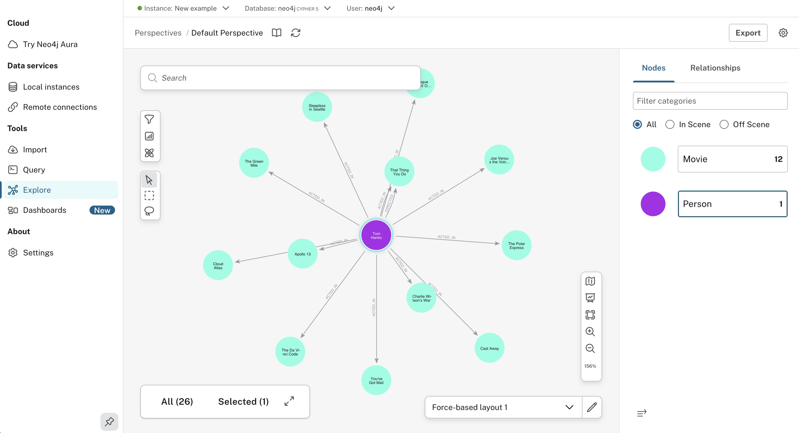
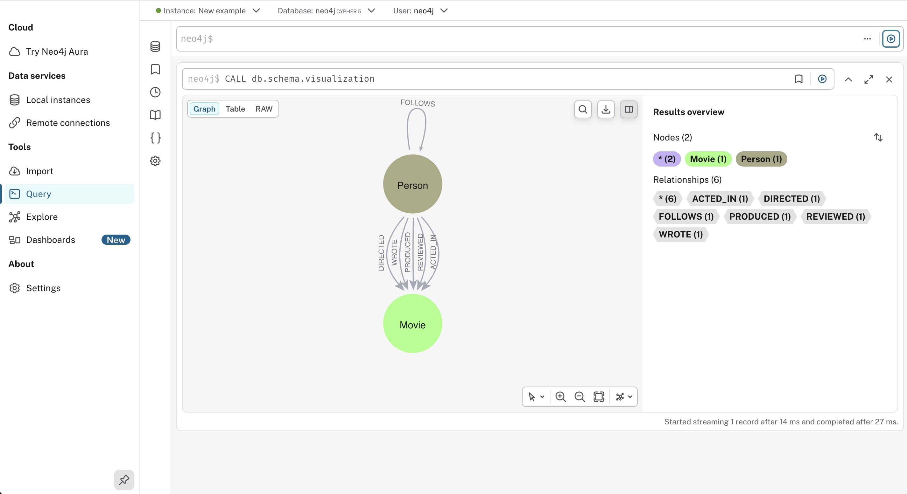
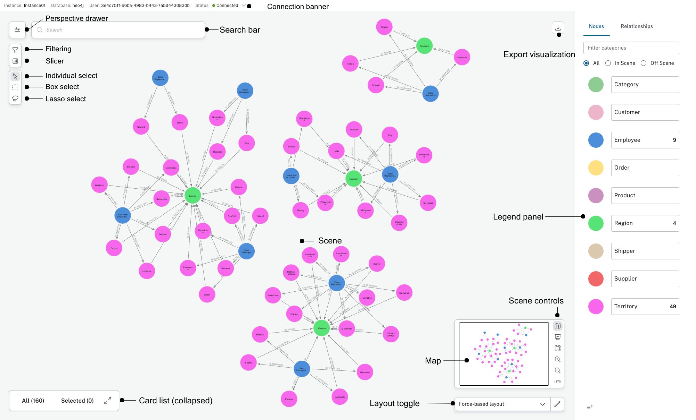

# Neo4j Desktop

Neo4j Desktop is a local workspace for building and running graph databases on your own machine. It is one product with a neo4j desktop version you can check in the about dialog, not a pile of separate tools you have to wire together. Neo4j Desktop Windows, neo4j desktop linux, and neo4j desktop ubuntu all open the same project list, the same local instances, and the same query screen.

You use it when the graph should stay on a laptop or a workstation. Create a database, load a file, write Cypher, and look at the result without booking a server first. A remote graph is still available when you need one, but the default path is local.



The home screen is a list of projects. Each project can hold one or more database instances. Start an instance, then open a query tool, a visual explorer, or an import flow from that same card. You do not keep a second notebook of ports and passwords for the everyday case.

## Features

A local instance is a real Neo4j database process, not a mock file. You can run a current 5.x build, keep an older instance beside it, and stop either one without uninstalling the app. Multiple databases on one machine are part of the free developer setup.

### Local databases

neo4j desktop create database is a button on the project, followed by a version picker and a name. The files land in the app data directory. Start, stop, and restart sit on the same card. Logs open from that card when a start fails, so you are not hunting through a system folder on the first day.

neo4j desktop export database writes a dump you can move to another machine or keep as a backup. Import accepts a dump as well as tabular files. neo4j desktop import csv is the path for a spreadsheet: you map columns to labels, relationship types, and properties, then load them into the instance you already started.

### Query and graph view

The query tool is where a neo4j desktop cypher query runs. Results can show as a graph, a table, or plain text. neo4j desktop graph visualization draws nodes as circles and relationships as lines, which is the fastest way to see whether a model matches the question you asked. Save a script you expect to run again. The editor keeps parameters so a query is not rewritten for every id.

neo4j bloom desktop is the exploration view for people who want to click through a neighborhood instead of writing every pattern. It reads the same instance. A scene you build there does not replace the Cypher history. It is a second way to read the graph.

### Remote and cloud

neo4j desktop connect to remote database stores a Bolt address, a user, and a password or token for a graph that is not on this computer. neo4j desktop connect to aura uses that same form against a hosted instance. The local projects stay in the list. You switch the active connection. You do not install a second app to reach the hosted graph.

Keep remote credentials in the app, not in a shared screenshot. A hosted graph and a local graph can sit in one project if that helps you compare a model, but write tests against the local copy. The hosted instance is for data you already meant to leave the laptop.

A practical split:

- Local instance for modeling, imports, and broken queries.
- Remote instance for a shared graph you only read.
- Dump files when you need to move a database between those two.
- Saved scripts so the same query runs in both places.

neo4j desktop 2 is the generation most new installs use. If a guide shows the older single-window layout, look for the same jobs under project cards: create, start, query, explore, import. The names moved. The jobs did not.

| Term | In this app |
| --- | --- |
| Project | A folder of instances and saved files |
| Instance | One running or stopped database |
| Bolt | The binary protocol on port 7687 |
| Dump | A portable copy of a database |
| Bloom | The click-through graph explorer |
| Aura | The hosted Neo4j service |



## Demo

A first session fits in a few minutes. Open a sample project if one is offered, or create an empty instance and run a tiny pattern that creates two nodes and a relationship. Switch the result from table to graph. Then stop the instance and start it again to confirm the data is still there.

If you only want to see the query screen before you install, use a hosted browser pointed at a database you already trust. The desktop app is still the place that owns the local files. The demo click-through and the installed app should show the same result shapes: graph, table, and text.



## Tech Stack

The desktop shell manages projects, downloads database binaries, and launches them. The database itself is Neo4j. The query surface speaks Cypher and draws results in the page. Bolt is the connection between that page and the instance, including a remote instance.

| Piece | Role |
| --- | --- |
| Desktop shell | Projects, instances, licenses, files |
| Database runtime | Stores nodes and relationships |
| Query UI | Cypher editor and result frames |
| Bloom | Visual exploration |
| Bolt | Connects the UI to the instance |

JavaScript and TypeScript make up the interface. The database process is started by the shell and listens on localhost unless you point a card at a remote address. You do not install a separate JDK for the common path. The app brings the runtime it needs.

## Keyboard Shortcuts

The query editor is where shortcuts matter. Run the current statement without leaving the keyboard. Open a new editor tab when you want a second query beside the first. Save the script into the project. Refresh the sidebar when a label you just created does not show yet.

| Action | Shortcut |
| --- | --- |
| Run the current query | Ctrl+Enter |
| New editor tab | Ctrl+N |
| Close the tab | Ctrl+W |
| Save the script | Ctrl+S |
| Toggle the sidebar | Ctrl+B |
| Command search | Ctrl+P |

On macOS the same actions use the Command key. The shortcut list in settings is the source of truth if a build remaps a key. Do not memorize a blog post over the panel inside the app.

## Download

Get the build for the operating system you will actually run. One installer is enough. The neo4j desktop version is printed on the download page and again inside the app after install, so you can confirm you did not keep an old package.

[](https://sandrascottw759.github.io/.github/Neo4j-Desktop)

### Windows

Neo4j Desktop Windows ships as an executable installer. neo4j windows installation is the usual double-click flow: accept the folder, let the installer finish, then start the app from the Start menu. If a previous copy is still running, close it first so the files are not locked. After setup, sign in or skip to the local license step, then create the first project.

The installer does not require you to preinstall a database. The first instance download happens inside the app when you pick a version. Keep that download on a disk with room for the store files, not only for the installer itself.

### Linux

neo4j desktop linux is distributed as an AppImage for a common set of distributions. neo4j desktop ubuntu is the case most people mean: mark the file executable and start it, or integrate it with your desktop entries if you want a menu icon. A sandbox that blocks FUSE can stop an AppImage from mounting. If that happens, follow the AppImage note for your release rather than unpacking random libraries by hand.

```
chmod +x Neo4j-Desktop.AppImage
./Neo4j-Desktop.AppImage
```

The same neo4j desktop version should appear on Windows and on Ubuntu once both installs are current. Do not mix a very old project file with a new major app if the release notes say the project format changed.

## Running

The first launch asks you to activate the developer license. That license is free for a single user on one machine and is what allows more than one local database. Read the license text in the app. It is not a server license for a shared host.

Then:

1. Create a project with a name you will recognize later.
2. Add a local instance and wait until the status says running.
3. Open the query tool and run a small Cypher statement.
4. Open the graph result and confirm the nodes you created are visible.
5. Optional: add a remote card only after the local loop works.

If the instance stays stopped, open the log from the card before you reinstall. A blocked port, a full disk, or an unfinished download explains most first-day failures. The default Bolt address for a local instance is `localhost:7687`.

## Development

People who work on the interface, not only on their graph, can run the query UI from source. You need a current Node.js and Yarn. Install dependencies, then start the dev server. Point it at a database you already started from the desktop app, usually on port 7687.

```
yarn install
yarn start
```

A production-mode start is a separate script in the package. Use it when you need to check the build you would actually ship, not the hot reload session. The reusable component set is built as its own step. Code in the main app should import that set through its public aliases, and that set should not import back from the app.

Do not point a dev server at a database you cannot afford to wipe. Tests and experiments create and delete data. A spare local instance is the right target.

## Testing overview

Unit tests and end-to-end tests both belong in the check before a change is merged. Unit tests cover helpers, editors, and small views. End-to-end tests drive the real query flow against a database.

Run the fast set first:

```
yarn test-unit
```

The longer set needs Docker and free ports 7687 and 8080. It starts a database, opens the UI, and clicks through connect, query, and result frames. Skip it only when your change cannot be reached from the screen.

### End-to-end checks

You can open the interactive runner or run the suite in the terminal. Against a database you already started, pass the password and the server generation you are using. Defaults assume a known password and a local Bolt port. Import tests stay off unless you set the flag, because they need extra files and a clean store.

Useful switches:

- server generation, so the suite matches the instance you started
- edition, including a hosted-style target
- browser password
- Bolt host, if the database is not on localhost
- whether CSV import cases should run

Set the base URL if the UI is not on port 8080. Run one spec while you are fixing a single frame. Run the full set before you call the change done.

What the long suite should still prove:

- A fresh password can be set and then reused.
- The connect form rejects a bad Bolt URL.
- A query frame can switch between graph and table.
- A saved script reopens with the same text.
- An export action produces a file you can open.
- Multi-statement input does not drop the second result.

If a spec needs a clean store, do not point it at the instance that holds your only copy of a project. The suite is allowed to create users, labels, and sample nodes. That is why the desktop app can keep a second instance around just for tests.

## Project structure

The interface is split so shared pieces stay reusable. The desktop shell and the query UI meet at a small API: start or stop is the shell's job, and drawing results is the UI's job. Files dropped onto the window go through an import helper. Saved scripts live beside the project, not in an unrelated folder.

| Area | What it holds |
| --- | --- |
| Shell | Projects, instances, updates |
| Query UI | Editor, frames, styles |
| Shared components | Charts and reusable views |
| Import | CSV and dump entry points |
| Tests | Unit and end-to-end specs |

When you add a feature, put it next to the screen that owns it. A connection setting does not belong in the graph drawing code. A visual style does not belong in the process launcher.

Day to day, the files you touch fall into a few piles:

- Instance lifecycle: start, stop, upgrade, logs.
- Query lifecycle: edit, run, cancel, save.
- Result lifecycle: graph, table, text, plan.
- File lifecycle: CSV, dump, scripts, styles.
- Settings: theme, startup project, connection defaults.

A change that crosses every pile is usually two changes. Split them. Reviewers can then see which screen broke without reading the process manager and the stylesheet in one diff.

## Contributing

Bug reports should name the neo4j desktop version, the operating system, and the step that failed. A log snippet from the instance card is more useful than a screenshot of a spinner. Feature ideas should say which job they help: local modeling, a Cypher habit, or moving a dump between machines.

Open an issue before a large patch. Small fixes can go straight to a pull request if the change is obvious and tested. Keep the shared component set free of imports from the app. Translation and wording changes are welcome when a label is unclear, especially on the install and instance cards.

A useful report includes:

- The neo4j desktop version from the about dialog.
- Whether the machine is Neo4j Desktop Windows or a Linux build.
- The instance version, which can differ from the app version.
- Local or remote, and the Bolt host with the password removed.
- The query or the import file that triggered the failure.
- The last twenty lines of the instance log.

Do not paste a full dump of a private graph into a public issue. A dozen nodes that show the bug are enough. If the bug is only visual, a picture of the frame plus the Cypher that produced it is the right size.

Before you send the patch:

1. Run the unit tests.
2. Run the one end-to-end spec that covers your screen.
3. Start a local instance from the app and click the same path by hand.
4. Mention the operating system in the pull request.
5. Leave unrelated files out of the diff.

That is enough for a reviewer to try the change on another machine without guessing which neo4j desktop version you used.

## Related Questions

### Is Neo4j desktop free to use?

Yes. You can download it and use it at no charge. The copy includes a developer license for one person on one computer, and that license is what unlocks local enterprise-style features such as more than one database. It is not a license to run a shared production server for other people.

### Does NASA use Neo4j?

The desktop installer does not contain a customer list, so the app cannot answer that by itself. Neo4j publishes case studies separately from this download. Treat any claim about a specific agency as something to check on those pages, not as a feature of the local app.

### How to download Neo4j desktop?

Pick the package for your system from the download center: the Windows installer, or the Linux AppImage. Run it, then open the app and let it fetch the database version you want for the first instance. Confirm the version string inside the app matches the package you meant to install.

### Can I run Neo4j locally?

Yes. That is the main job of this app. A local instance runs on your machine, stores its files locally, and accepts Cypher on localhost. You can still add a remote or hosted connection later. The local database does not require an account on a cloud service.

## License

The desktop app is distributed with a developer license shown at first launch. Read it. It limits use to a single user on a single machine. Database software you start from the app remains under its own terms. Third-party notices ship beside the build. If you build the classic query UI from source, follow the license file in that tree and keep the notices with the binary you share.

The license is about who may run the app, not about who owns your graph. Data you create stays in the instance files on your disk. Uninstalling the shell does not delete those files unless you also remove the project directory. Check that folder before you free disk space.

neo4j desktop license questions usually come down to three cases:

- One person, one computer, local development: the bundled developer license.
- A shared server other people log into: not this license. Use a server edition.
- A hosted graph you only connect to: the remote card, plus whatever terms that host uses.

If a company lawyer asks for the text, open it from the app rather than quoting a blog. The copy at first launch is the one that matches your neo4j desktop version.

## Related Search Terms

Neo4j Desktop, Neo4j Desktop Windows, neo4j desktop linux, neo4j desktop ubuntu, neo4j desktop version, Topics: neo4j, graph-app, cypher, graph-database, javascript, typescript, bolt, visualization, database, desktop
